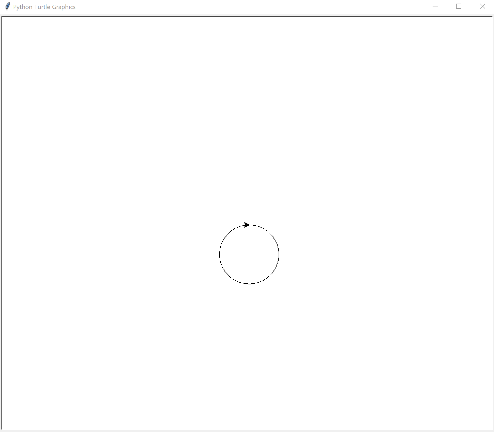

# Turtle

Turtle ist eine Python Library, mit der man simple Grafiken auf den Bildschirm zeichnen kann.


Man kann den Turtle mit befehlen wie `forward()`, `left` und `right()` steuern.

```python
# Turtle Importieren
from turtle import *

# Damit der Turtle anfängt zu zeichnen, müssen wir den Stift heruntersetzen
pendown()

# Der Turtle soll jetzt 100 Pixel nach vorne Fahren
forward(100)

# Damit der Turtle aufhört zu zeichnen
penup()
```

Wenn man diesen Code ausführt, würde das Resultat so aussehen


## Aufgaben

### Quadrat

Zeichne mit den `forward()`, `left()` und `right()` Befehlen ein Quadrat


***

### Dreieck

Zeichne ein Dreieck


***

### Stern

Zeichne einen Stern


#### Tipp

Verwende eine `while` oder `for` schleife

***

### Kreis

Zeichne einen Kreis mit den `forward()` und `right()` funktionen



#### Optional

Mach den Radius konfigurierbar

###

***

### Baum

Zeichne einen Baum

Mit dem `backward()` Befehl kann der Turtle nach hinten fahren.


#### Tipp

Benutze eine Funktion um den Code nicht zu duplizieren

```python
def zeichne_ast(ast_laenge):
    if ast_laenge < 5:
        # Brich die Funktion ab
        return

    # TODO: Zeichne eine Linie die ast_laenge gross ist. Drehe nach rechts um den nächsten Ast zu zeichnen.
    # Hier wird ein ast gezeichnet der 15 Pixel kleiner ist als der letzte.
    # Dieser Ast soll 25 Grad nach rechts zeigen
    zeichne_ast(ast_laenge - 15)
    
    # TODO: Zeichne den zweiten Ast links
    zeichne_ast(ast_laenge - 15)

    # TODO: Fahre ast_laenge zurück um den nächsten ast zu zeichnen
```