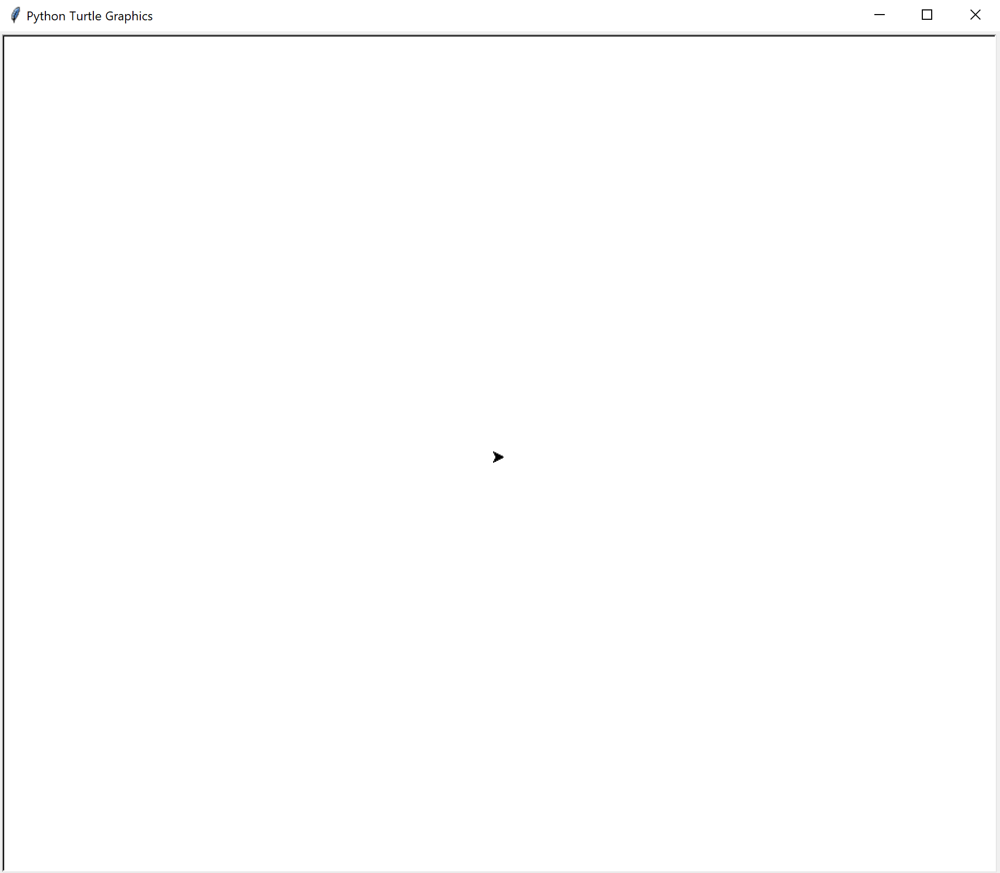
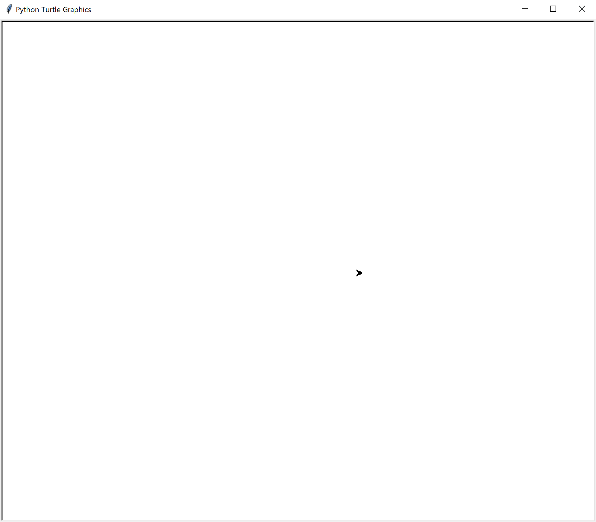
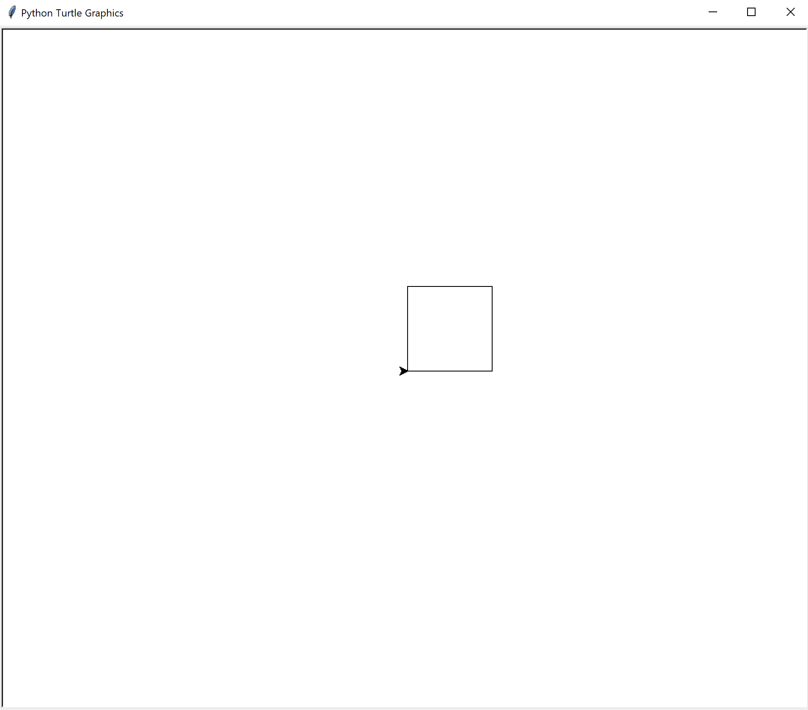
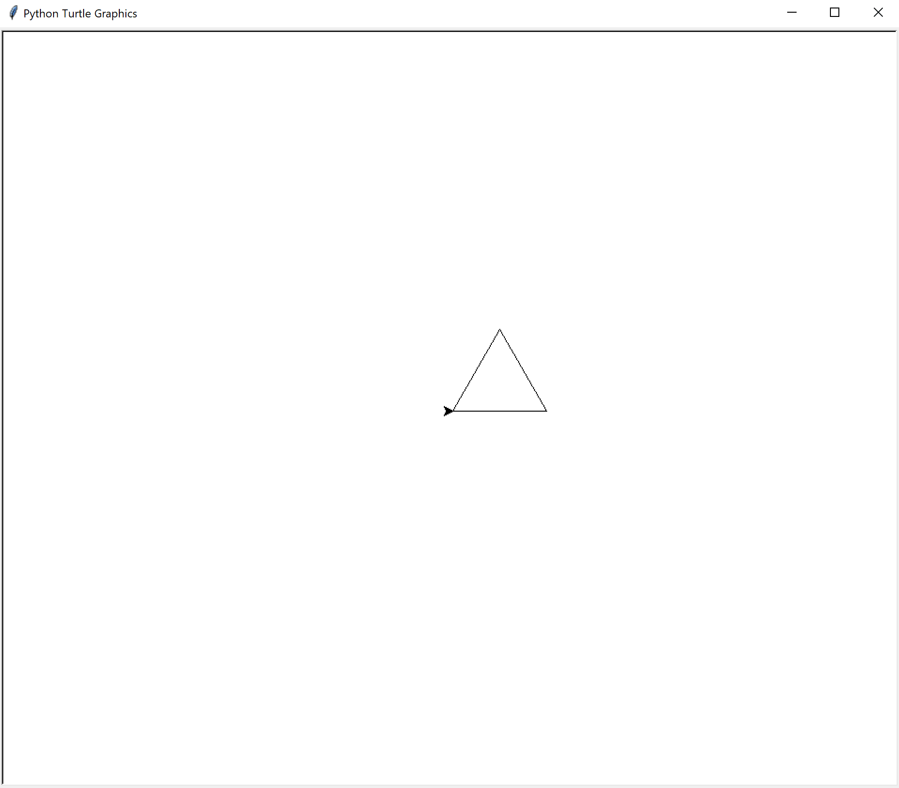
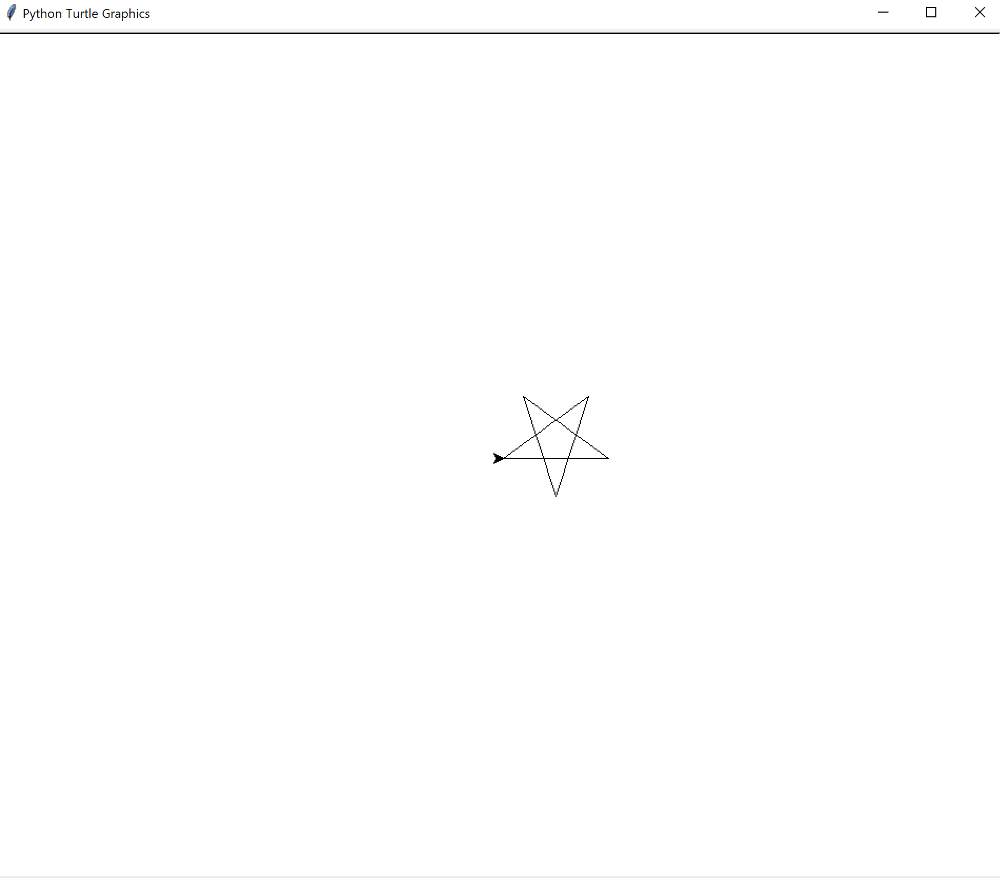
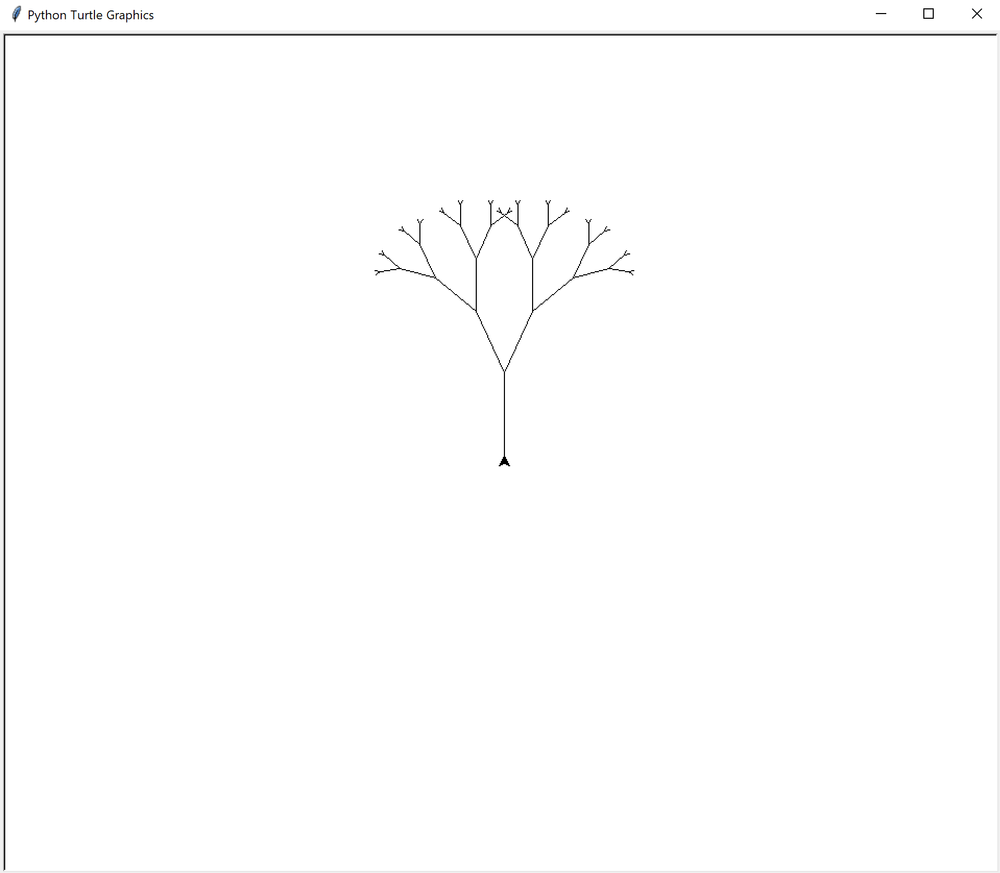

# Turtle

Turtle ist eine Python Library, mit der man simple Grafiken auf den Bildschirm zeichnen kann.



Man kann den Turtle mit befehlen wie `forward()`, `left` und `right()` steuern.

```python
# Turtle Importieren
from turtle import *

# Damit der Turtle anfängt zu zeichnen, müssen wir den Stift heruntersetzen
pendown()

# Der Turtle soll jetzt 100 Pixel nach vorne Fahren
forward(100)

# Damit der Turtle aufhört zu zeichnen
penup()
```

Wenn man diesen Code ausführt, würde das Resultat so aussehen



## Aufgaben

### Quadrat

Zeichne mit den `forward()`, `left()` und `right()` Befehlen ein Quadrat



***

### Dreieck

Zeichne ein Dreieck



***

### Stern

Zeichne einen Stern

#### Tipp

Verwende eine `while` oder `for` schleife



***

### Baum

Zeichne einen Baum

#### Tipp

Mit dem `backward()` Befehl kann der Turtle nach hinten fahren

