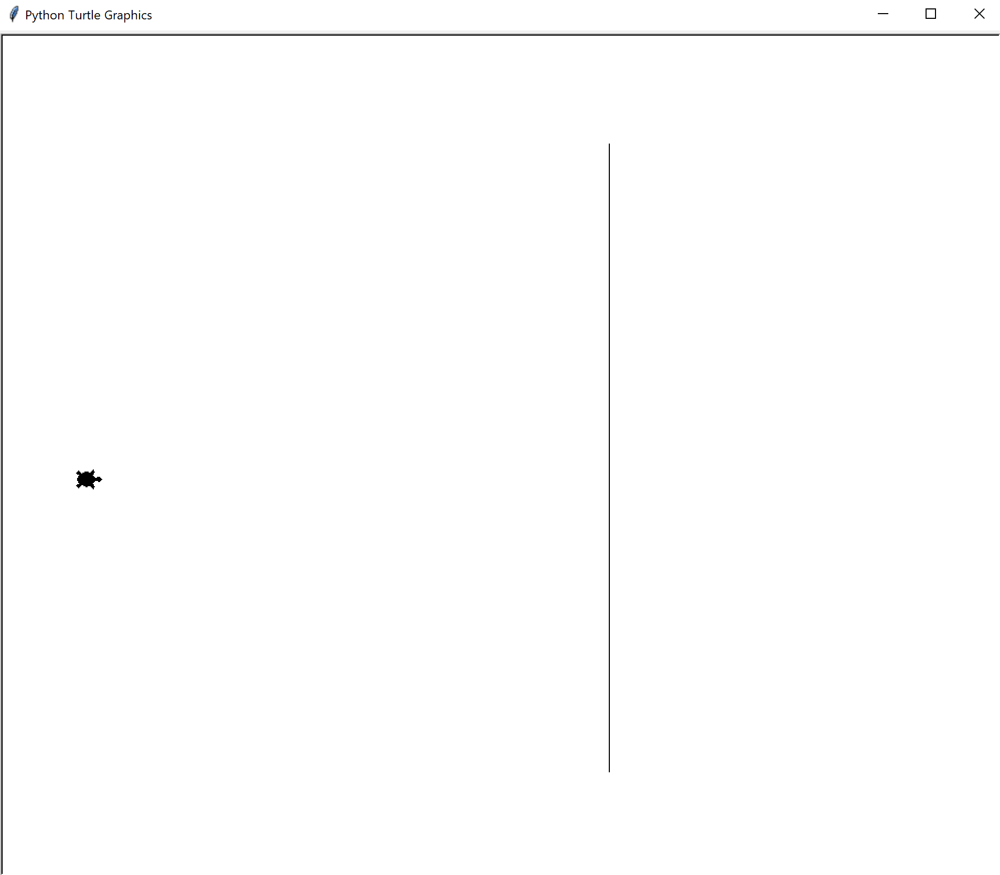
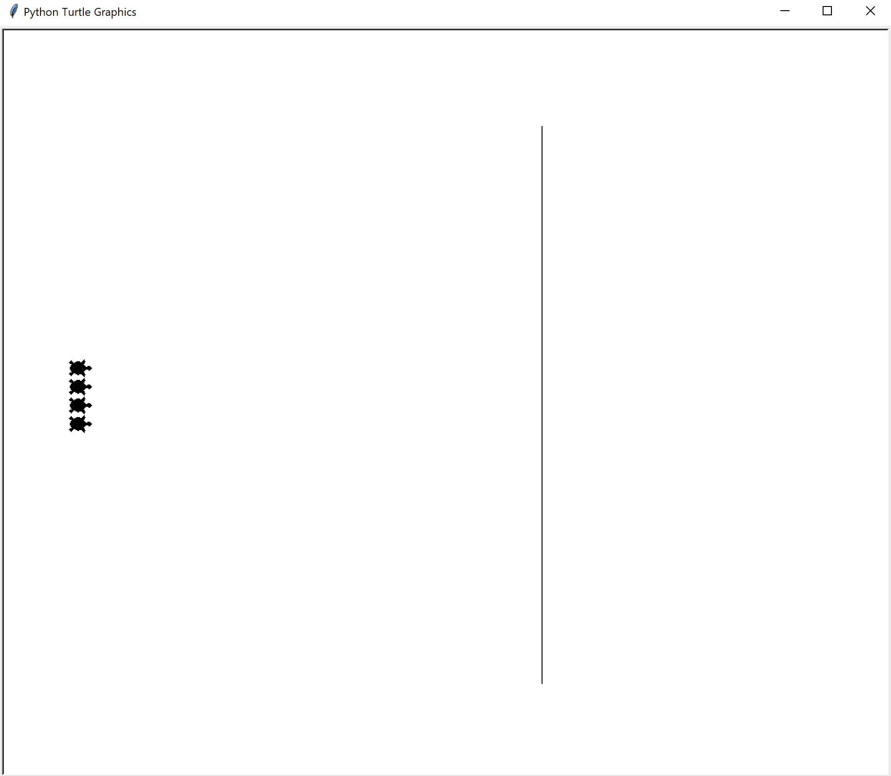
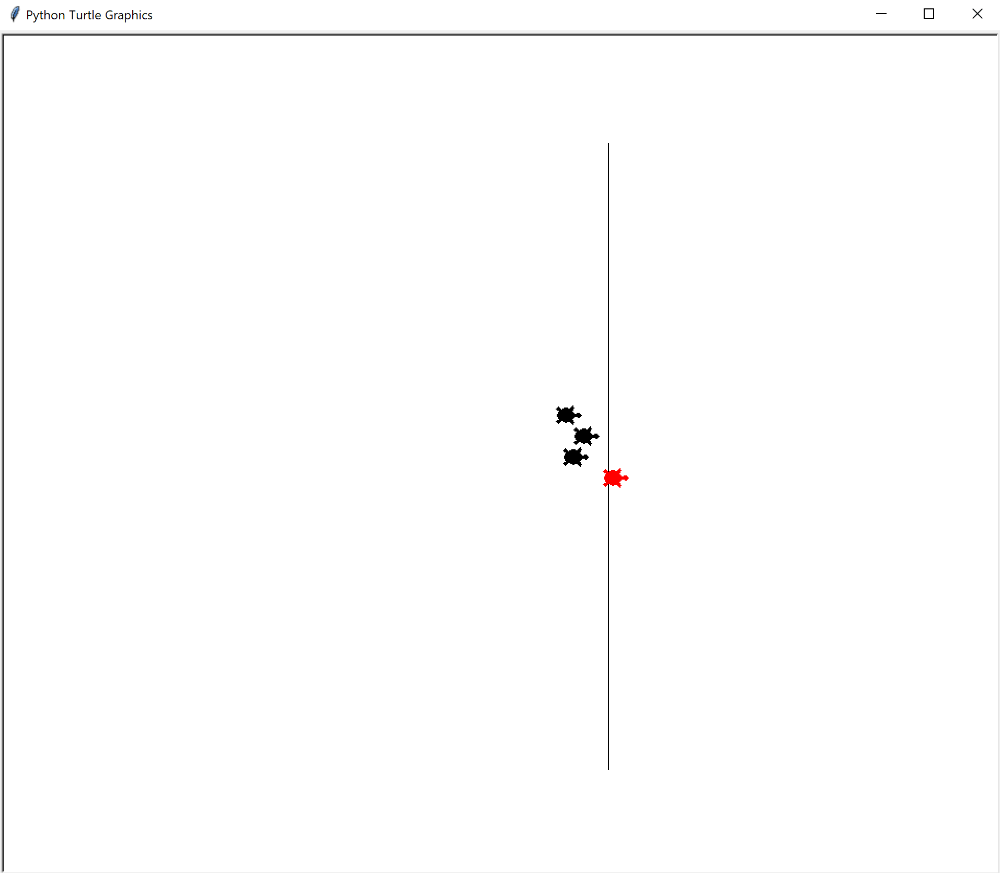

# Turtle Rennen

Bei dieser Applikation sollen 4 Turtles bei einem Rennen teilnehmen.
Der erste welche die Schwarze Linie überschreitet, gewinnt das Spiel.

Die fertige Applikation soll wie gefolgt aussehen

## Tipp

Um den Turtle rot zu markieren, kann die `color("red")` Funktion verwendet werden.

Beispiel `turtle_1.color("red")`